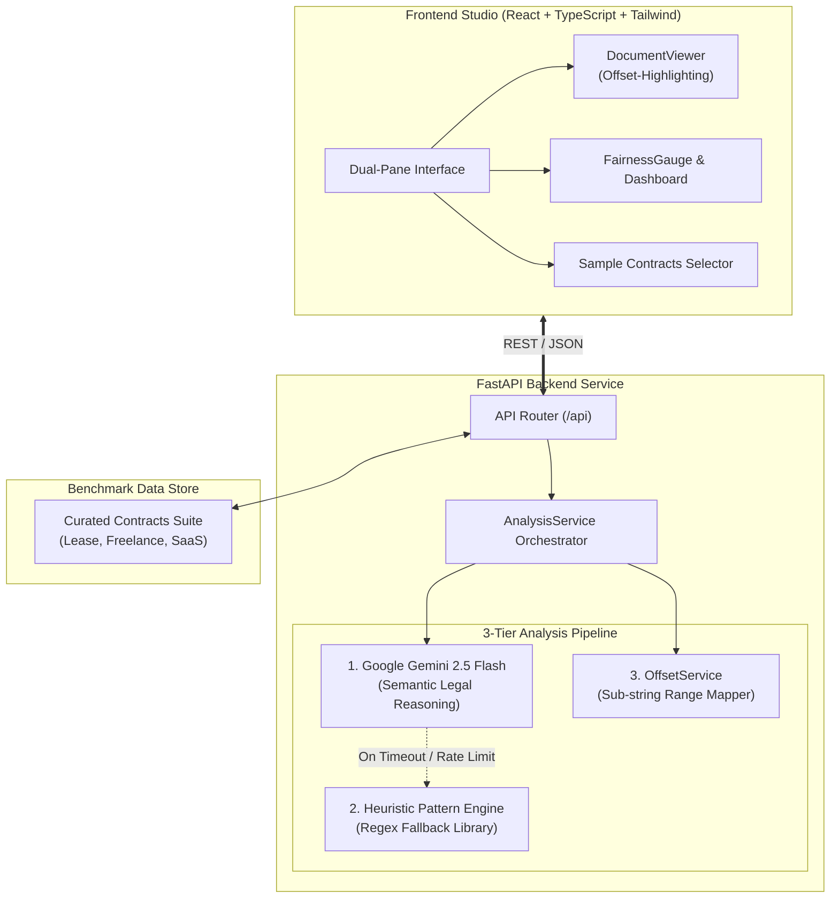

<div align="center">

# ⚖️ ClauseLens
### *The AI Contract Guardian for Everyday People*

**Built 100% via Voice using [Wispr Flow](https://wisprflow.ai) in the Antigravity IDE**  
*HackerHouse Goa 2026 Hackathon Track • Devfolio Submission*

<br/>

[](https://fastapi.tiangolo.com)
[](https://react.dev)
[](https://www.typescriptlang.org)
[](https://tailwindcss.com)
[](https://ai.google.dev)
[](https://vitejs.dev)
[](https://wisprflow.ai)
[](LICENSE)

<br/>

<p align="center">
  <b>ClauseLens</b> audits dense, intimidating legal agreements in under <b>2 seconds</b>. It highlights predatory traps directly in the text, rates the contract's fairness from 0 to 100, and generates professional, lawyer-grade counter-clauses that renters, freelancers, and everyday signers can copy and negotiate with immediately.
</p>

[Explore Features](#-key-features) • [System Architecture](#-system-architecture) • [Curated Benchmarks](#-pre-seeded-benchmark-contracts) • [Quick Start](#-quick-start-guide) • [Wispr Flow Story](#-the-voice-driven-build-story)

---

</div>

<br/>

## 🚨 The Problem

Every adult signs contracts—apartment leases, employment letters, freelance gigs, and digital Terms of Service. **Yet 99% of people never read them.**

Legal language is intentionally archaic, dense, and opaque. Counterparties exploit this information asymmetry:
* **Landlords** bury clauses allowing unannounced entry at any hour or seizing 100% of your security deposit as a non-refundable "cleaning fee".
* **Clients** sneak in unlimited personal liability or claim perpetual ownership of prior IP and personal tools for AI training.
* **SaaS Providers** slip in unilateral price hikes and cap their total data-breach liability at $1.00.

Hiring a lawyer costs hundreds of dollars an hour. **ClauseLens levels the playing field.**

---

## ✨ Key Features

| Feature | Description |
| :--- | :--- |
| **⚡ Sub-2s Contract Auditing** | Instant full-document parsing powered by Google Gemini 2.5 Flash, backed by an offline regex-pattern heuristic fallback. |
| **🎯 Verbatim Character-Offset Tracing** | Powered by an intelligent 4-tier `OffsetService` that maps exact character start/end coordinates to prevent broken HTML tags or word clipping. |
| **🛡️ 3-Tier Risk Classification** | Every clause is classified into <kbd style="color:#ef4444;font-weight:bold">Danger (Predatory)</kbd>, <kbd style="color:#f59e0b;font-weight:bold">Warning (Ambiguous)</kbd>, or <kbd style="color:#10b981;font-weight:bold">Safe (Standard)</kbd>. |
| **📊 Dynamic Fairness Gauge (0–100)** | Radial animated SVG meter reflecting the contract's power balance alongside granular scores across **6 critical legal domains**. |
| **✍️ 1-Click Actionable Counterclauses** | ClauseLens doesn't just find problems—it generates polite, balanced, lawyer-grade alternative clauses ready to paste into WhatsApp or email. |
| **🔄 Bidirectional Studio Sync** | Clicking a red highlight in the document auto-scrolls to and focuses the matching card on the dashboard, and vice-versa. |
| **📑 1-Click Markdown Report Export** | Export a complete, formatted audit summary with key takeaways and clause remedies for offline record-keeping. |

---

## 🏛️ System Architecture

ClauseLens was built with a strict separation of concerns, featuring a resilient **3-Tier Analysis Pipeline**:



### 🛡️ The 6 Legal Risk Domains Audited
1. **Liability & Indemnification** — Unlimited personal liability, unilateral hold-harmless clauses.
2. **Intellectual Property & Data** — Overbroad IP assignment, unauthorized AI model training on private data.
3. **Payment & Financial Terms** — Excessive payment delays (90+ days), unilateral deposit forfeitures, price hikes.
4. **Termination & Exit** — Asymmetric immediate termination, rent acceleration penalties.
5. **Restrictive Covenants** — Worldwide non-compete bans, unreasonable non-solicitation periods.
6. **Privacy, Access & Compliance** — Unannounced landlord entry, mandatory arbitration & class action waivers.

---

## 🧪 Pre-Seeded Benchmark Contracts

To allow instant testing with zero setup, ClauseLens comes pre-loaded with curated real-world benchmark contracts:

| Contract | Domain | Real Score | Key Traps Flagged |
| :--- | :--- | :---: | :--- |
| **🏠 Residential Lease Agreement** | Real Estate | **42 / 100** | • 24/7 unannounced landlord entry<br/>• $5,000 automatic deposit forfeiture<br/>• Tenant liable for building roof/HVAC repairs<br/>• Full annual rent acceleration on exit |
| **💻 Freelance Dev Agreement** | Consulting | **34 / 100** | • Unlimited one-sided liability<br/>• Perpetual seizure of prior tools for AI training<br/>• 90-day delayed payment with unilateral withholding<br/>• 3-year global non-compete |
| **☁️ CloudFlow Terms of Service** | SaaS / Cloud | **48 / 100** | • User data exploited for public AI training<br/>• Unilateral price hikes without notice<br/>• $1.00 maximum liability cap for data breaches |

---

## 🎙️ The Voice-Driven Build Story

ClauseLens was built following the **GSD (Get Shit Done)** spec-driven engineering methodology. Rather than manually typing thousands of lines of boilerplate, the entire application was **dictated and orchestrated via voice** using **[Wispr Flow](https://wisprflow.ai)** paired with Google's **Antigravity IDE**:

* **Modular 5-Phase Architecture:**
  * **Phase 1–2:** Market research, competitive analysis, and contract schema formulation.
  * **Phase 3–4:** Voice-dictated Pydantic models, Gemini API orchestrator, and Tenacity retry handlers.
  * **Phase 5–7:** Voice-scaffolded Vite React studio, animated SVG meters, and bidirectional highlight listeners.
* **Why Wispr Flow Excelled:**
  * Dictating complex technical prompts (e.g., *"Wrap clauses with character start and end offsets, fallback to regex heuristic patterns on timeout, and enforce strict Pydantic JSON schemas"*) was transcribed with near-zero error rates, transforming hours of coding into a fluid, conversational workflow.

---

## 🚀 Quick Start Guide

### Prerequisites
* **Node.js:** v18+ & `npm`
* **Python:** v3.11+
* *(Optional)* A Google Gemini API Key (if omitted, ClauseLens automatically runs its built-in heuristic pattern engine and curated benchmarks).

---

### 1. Clone the Repository
```bash
git clone https://github.com/AugustyaB/clauselens.git
cd clauselens
```

---

### 2. Backend Setup
```bash
cd Backend

# Create & activate a virtual environment
python -m venv .venv
# Windows (PowerShell):
.venv\Scripts\Activate.ps1
# macOS/Linux:
source .venv/bin/activate

# Install dependencies
pip install -r requirements.txt

# (Optional) Add your Gemini API key to .env
cp .env.example .env
# Edit .env and set GEMINI_API_KEY=your_key_here

# Launch the FastAPI server
uvicorn main:app --reload --port 8000
```
Backend will be live at `http://localhost:8000` (API documentation at `http://localhost:8000/docs`).

---

### 3. Frontend Setup
In a new terminal window:
```bash
cd Frontend

# Install packages
npm install

# Start Vite dev server
npm run dev
```
Open **`http://localhost:5173`** in your browser.

---

## 📡 API Reference

| Method | Endpoint | Description |
| :--- | :--- | :--- |
| `GET` | `/api/health` | Health check & reports whether Gemini API key is active. |
| `GET` | `/api/samples` | Lists all pre-computed curated benchmark contracts. |
| `GET` | `/api/samples/{id}` | Fetches a specific benchmark contract with its audit payload. |
| `POST` | `/api/analyze` | Accepts raw contract text and returns structured `AnalysisResult`. |

#### Example `POST /api/analyze` Request
```json
{
  "contract_text": "Tenant shall deposit $5,000. Landlord may retain entire deposit upon move-out as cleaning fee...",
  "contract_type": "Residential Lease",
  "api_key": null
}
```

---

## 👨‍💻 Author & Acknowledgements

* **Developer:** [Augustya Bhushan](https://github.com/AugustyaB)
* **Event:** [HackerHouse Goa 2026](https://hhgoa.com) — Wispr Flow Task
* **Built With:** [Wispr Flow](https://wisprflow.ai) • [Antigravity IDE](https://deepmind.google) • [Google Gemini](https://ai.google.dev) • [FastAPI](https://fastapi.tiangolo.com) • [Vite React](https://vitejs.dev)

---

<div align="center">
  <sub>⚖️ <i>ClauseLens — Protecting signers, one clause at a time.</i></sub>
</div>
